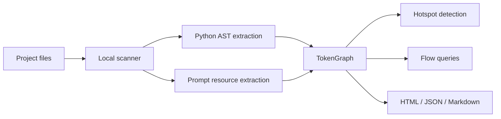

# TokenOptiPy — TokenGraph Engine

TokenOptiPy 0.4 analyzes Python, JavaScript, and TypeScript without executing project code, imports, package scripts, or dependencies. JavaScript and TypeScript use Tree-sitter with bundled platform wheels (`tree-sitter-javascript` and `tree-sitter-typescript`).

<p align="center">
  <strong>See where tokens enter your Python LLM application.</strong>
</p>

<p align="center">
  Local static analysis · Provider-independent · No mandatory API key
</p>

<p align="center">
  <a href="https://github.com/MEEDamrane/TokenOptiPy/actions/workflows/ci.yml">
    
  </a>
  <a href="https://www.python.org/">
    
  </a>
  <a href="LICENSE">
    
  </a>
  
</p>

---

LLM requests often contain much more context than expected. A single call may combine a
system prompt, conversation history, retrieved documents, schemas, examples, and complete
data files.

TokenOptiPy scans a project locally and builds a graph connecting token-bearing content to
the model calls that consume it. It helps you locate expensive context before changing
prompts blindly.

```bash
pip install git+https://github.com/MEEDamrane/TokenOptiPy.git
tokenoptipy build .
tokenoptipy hotspots
```

Open `tokenoptipy-out/graph.html` to explore the result.

### Universal MCP setup

```bash
tokenoptipy mcp-config --client all
tokenoptipy agent-init --client all
python -m tokenoptipy.mcp_server
```

This generates local stdio configuration for Codex, Claude Code/Desktop, GitHub Copilot and
VS Code, Cursor, Windsurf, Cline, Roo Code, Continue, and generic MCP clients. The MCP tools
include `get_prompt_flow` and `build_graph_report`; prompt bodies and sensitive arguments are
never written to traces.

> [!IMPORTANT]
> Token counts and optimization opportunities are estimates produced through static
> analysis. Runtime inputs may differ, and reducing tokens does not guarantee equal model
> quality. Validate changes with representative evaluation cases.

## What TokenOptiPy produces

```text
tokenoptipy-out/
├── graph.html       # Interactive local visualization
├── graph.json       # Machine-readable TokenGraph
└── TOKEN_REPORT.md  # Hotspots, findings, and recommendations
```

## Why use it?

| Problem | TokenOptiPy evidence |
|---|---|
| “This model call is expensive, but why?” | Ranks prompts and calls by estimated static tokens |
| Context is assembled across several files | Connects files, variables, functions, and model calls |
| Conversation history can grow indefinitely | Flags potentially unbounded dynamic history |
| Instructions are duplicated | Detects exact and approximate prompt overlap |
| Reports might expose credentials | Redacts likely secrets from stored previews |
| The application uses local or mixed providers | Runs without ChatGPT or a mandatory remote API |

## Example investigation

```text
Analyzed call: answer_customer

Estimated before: 12,470 tokens
Estimated after:   2,180 tokens
Potential reduction: 82.5%

Main detected sources:
├── full product catalog       8,500 tokens
├── conversation history      2,900 tokens
└── system prompt               320 tokens
```

This example illustrates the type of investigation TokenOptiPy supports. The “after”
result depends on an application-specific change—such as retrieving only relevant catalog
entries or limiting history—and must be evaluated for task quality.

## How it works



The scanner does not execute analyzed Python code. Its default token counter is a
dependency-free local approximation; an optional model-specific tokenizer can provide
different counts.

## Five-minute tour

### 1. Build a graph

```bash
tokenoptipy build path/to/project --output tokenoptipy-out
```

Use `--update` to skip rebuilding when supported project files have not changed:

```bash
tokenoptipy build . --update
```

### 2. Inspect the largest inputs

```bash
tokenoptipy stats
tokenoptipy hotspots --limit 20
```

### 3. Explain a node or follow a path

```bash
tokenoptipy explain classify_customer
tokenoptipy path customer_message client.chat.completions.create
```

### 4. Search the graph locally

```bash
tokenoptipy query "where is history injected"
```

## Included example

```bash
tokenoptipy build examples/token_graph_project --output example-out
tokenoptipy hotspots --graph example-out/graph.json
tokenoptipy explain conversation_history --graph example-out/graph.json
tokenoptipy path CLASSIFY_PROMPT conversation_history --graph example-out/graph.json
```

## Detected graph elements

### Node types

`file` · `function` · `prompt` · `variable` · `context` · `model_call`

### Common relations

`DEFINES` · `DEFINES_PROMPT` · `CONTAINS_PROMPT` · `USES_VARIABLE` ·
`FLOWS_TO` · `CALLS_MODEL` · `DUPLICATES`

### Findings

| Rule | Meaning |
|---|---|
| `TG001` | Large static prompt |
| `TG002` | Repeated or strongly overlapping prompts |
| `TG003` | Many few-shot examples |
| `TG005` | Potentially unbounded conversation context |
| `TG006` | Prompt with many dynamic values |
| `SEC001` | Possible secret in prompt content |

## Supported inputs

- Python source (`.py`)
- prompt and text files (`.txt`, `.prompt`, `.md`)
- structured resources (`.json`, `.yaml`, `.yml`)
- Jinja templates (`.jinja`, `.jinja2`, `.j2`)

Python extraction currently recognizes multiline strings, f-string placeholders, direct
prompt references, and common model-call names such as `generate`, `invoke`, `create`,
`complete`, and `chat.completions.create`.

## Standalone prompt optimization

The original prompt optimizer remains available:

```bash
tokenoptipy optimize prompt.txt \
  --required-term JSON \
  --output prompt.optimized.txt \
  --report optimization.json
```

Transformations preserve configured required terms and are checked by local validators.
They still require application-level quality evaluation before deployment.

## Privacy and security

- Analysis runs locally by default.
- No source code or prompt is uploaded by TokenOptiPy.
- No ChatGPT or OpenAI API key is required.
- Likely credentials are redacted from short prompt previews.
- Reports still contain file names, hashes, signatures, and redacted previews; review them
  before publishing.

Please report vulnerabilities according to [SECURITY.md](SECURITY.md).

## Current limitations

- Static analysis cannot know the final size of runtime history, retrieved documents, or
  user input.
- The built-in tokenizer is an approximation.
- Prompt similarity can produce false positives or false negatives.
- Indirect, cross-module, and framework-specific flows may not always be resolved.
- A lower token count does not automatically preserve response quality.

TokenOptiPy provides inspectable engineering evidence, not a formal proof.

## Development

```bash
git clone https://github.com/MEEDamrane/TokenOptiPy.git
cd TokenOptiPy
python -m venv .venv

# Linux/macOS
source .venv/bin/activate

# Windows PowerShell
.venv\Scripts\Activate.ps1

pip install -e ".[dev]"
pytest -q
ruff check .
mypy src
python -m build
```

The CI matrix covers Python 3.10 through 3.13.

## Contributing

Useful first contributions include:

- adding a model-call detection fixture;
- documenting an Ollama, LangChain, or LlamaIndex example;
- improving JSON/YAML prompt classification;
- adding adversarial privacy tests;
- improving the interactive graph.

See [CONTRIBUTING.md](CONTRIBUTING.md) and look for
[`good first issue`](https://github.com/MEEDamrane/TokenOptiPy/labels/good%20first%20issue).

## Roadmap

- JavaScript and TypeScript parsing
- framework adapters for LangChain, LlamaIndex, and local model servers
- runtime trace import
- model-specific tokenizer plugins
- incremental per-file graph updates
- MCP server for local graph queries
- quality-aware optimization experiments

See the detailed [roadmap](docs/ROADMAP.md).

## License and citation

TokenOptiPy is available under the [MIT License](LICENSE).

Researchers can cite the project using [CITATION.cff](CITATION.cff).
